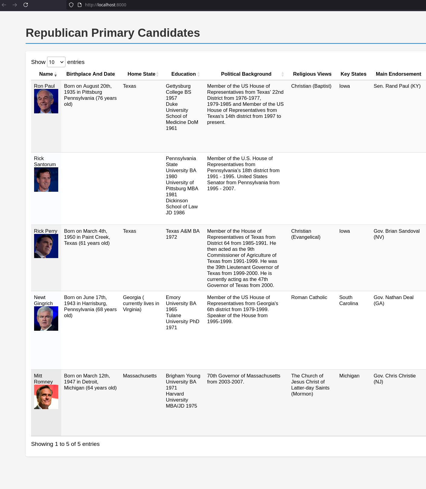

# Candidate View

A PHP web application that displays unbaised candidate data from a MySQL database in an interactive, sortable table.

## Screenshot



## Requirements

- PHP 7.4+ with `mysqli` extension
- MySQL database

## Local Setup

1. Clone the repo:
   ```bash
   git clone https://github.com/nstapc/candidate-view.git
   cd candidate-view
   ```

2. Install MySQL (MariaDB is recommended on Debian):
   ```bash
   sudo apt install mariadb-server
   sudo systemctl start mysql
   sudo mysql_secure_installation
   ```

3. Create the database and user:
   ```bash
   sudo mysql
   ```
   Then in the MySQL shell:
   ```sql
   CREATE DATABASE candidates;
    CREATE USER 'username'@'localhost' IDENTIFIED BY 'your_password';
    GRANT ALL PRIVILEGES ON candidates.* TO 'username'@'localhost';
   FLUSH PRIVILEGES;
   EXIT;
   ```

4. Import the provided SQL dump:
   ```bash
   mysql -u username -p candidates < candidates.sql
   ```

5. Set environment variables for your database connection:
   ```bash
   export DB_HOST=localhost
   export DB_USER=username
   export DB_PASS=your_password
   export DB_NAME=election
   ```

6. Serve with PHP's built-in server:
   ```bash
   php -S localhost:8000
   ```

7. Open `http://localhost:8000` in your browser.